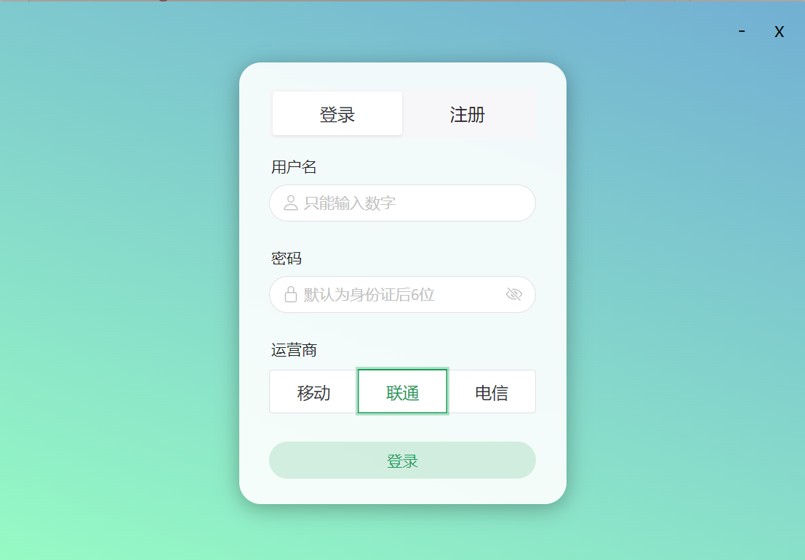
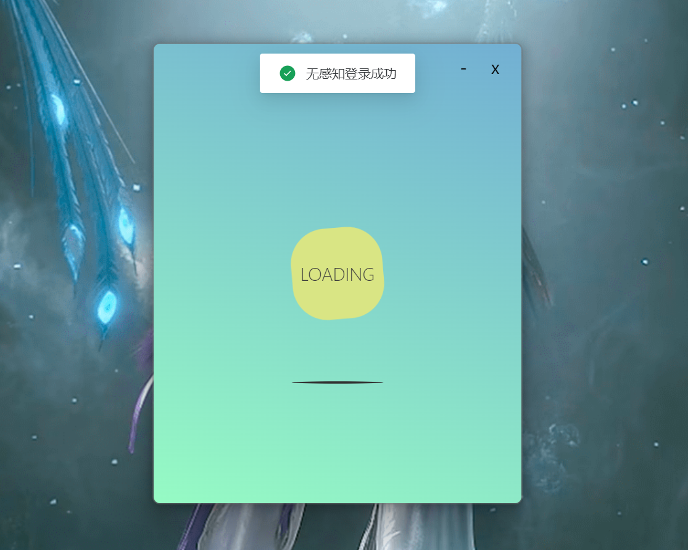
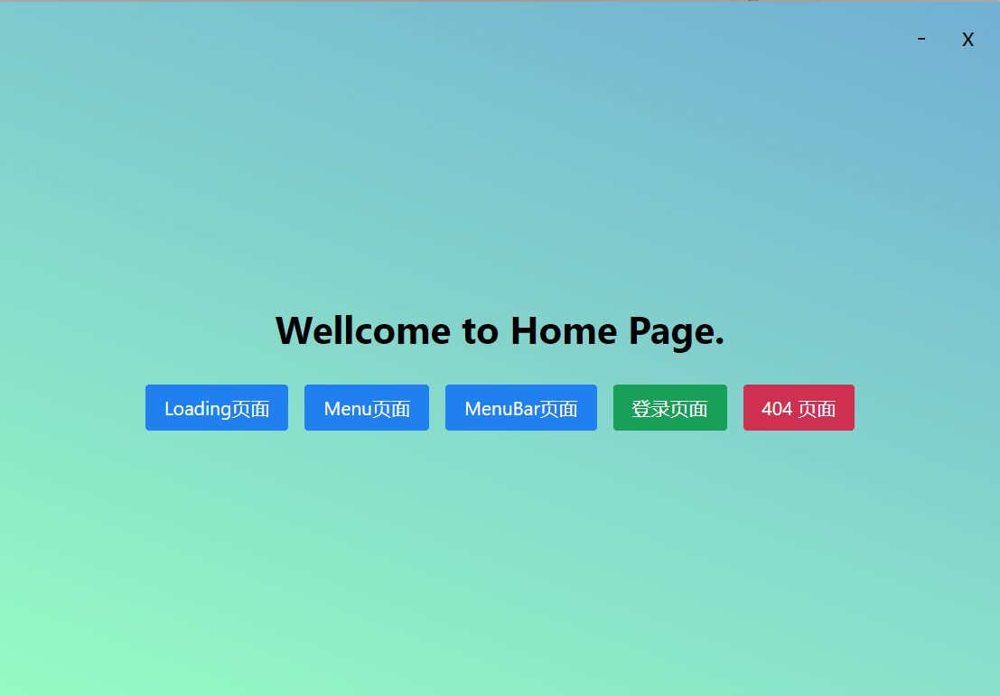
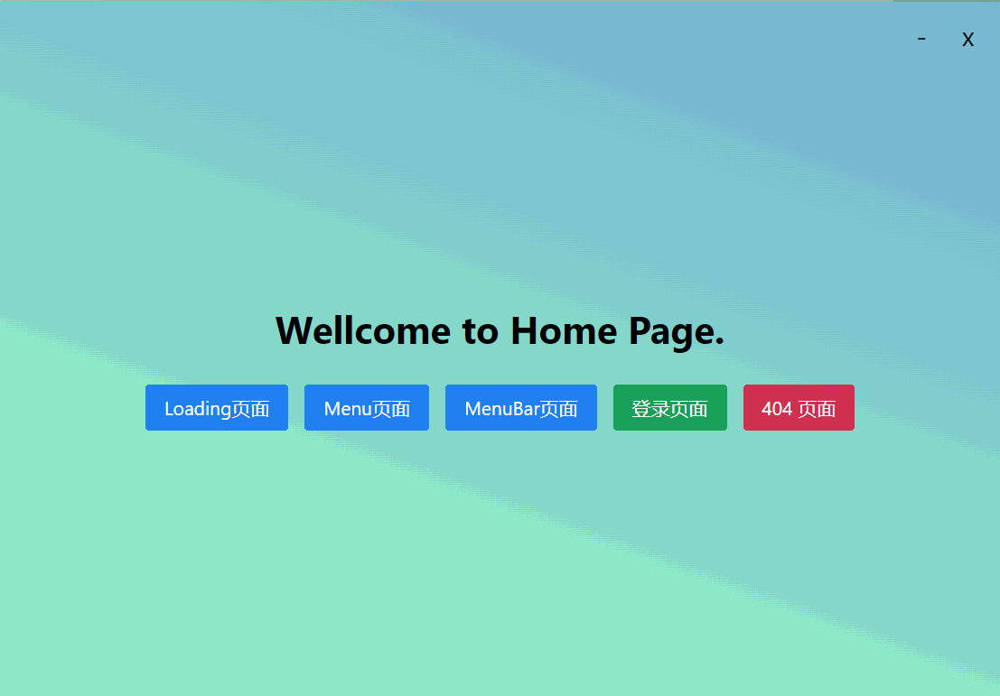

# sLogin

> 是一款采用 `wails + vue3 + ts` 构建的登录器, 适用于张家界学院校园网系统

[](https://github.com/Fromsko/sLogin/actions/workflows/main.yaml)

## 📑 功能模块

+ 登录 `@/views/Login.vue`
+ 云盘 `@/views/cloudPan.vue`
+ 小菜单 `@/components/ActionMenu.vue`

## 🚀 安装

> 推荐直接下载 release 文件构建的包
>
> 配置 Golang + NodeJs
>
> 推荐 [nvm-windows](https://github.com/coreybutler/nvm-windows)

<details>
<summary>Golang 验证</summary>

```shell
# 验证安装
go version

# 设置七牛云代理
go env -w GOPROXY=https://goproxy.cn,direct

# 验证代理设置
go env | grep GOPROXY

# 设置Go Module支持
go env -w GO111MODULE=on

# 验证Go Module设置
go env | grep GO111MODULE
```

</details>

<details>
<summary>Nodejs 验证</summary>

```shell
# 验证安装
node -v

# 设置淘宝代理
npm config set registry https://registry.npm.taobao.org
```

</details>

### 👨‍💻 安装 wails

[官方文档](https://wails.io/zh-Hans/docs/gettingstarted/installation/)

```shell
go install github.com/wailsapp/wails/v2/cmd/wails@latest 
```

### 构建项目

1. 检查缺少什么环境

    ```shell
    wails doctor
    ```

2. **构建**
    + 基础

        ```shell
        wails build
        ```

    + win 安装包 + 压缩

        ```shell
        wails build -nsis -upx
        ```

3. **开发**

    ```shell
    wails dev
    ```

## 📁 项目结构

<details>
<summary>后端结构</summary>

```txt
.
├── README.md
├── backend
│   ├── api         -- 接口路径
│   ├── app.go      -- 注入函数
│   ├── config      -- 配置目录
│   ├── model       -- 数据模型
│   └── utils       -- 工具函数
├── frontend
│   ├── README.md
│   ├── auto-imports.d.ts
│   ├── components.d.ts
│   ├── index.html
│   ├── package.json
│   ├── src
│   ├── tsconfig.json
│   ├── tsconfig.node.json
│   ├── vite.config.ts
│   └── wailsjs
├── go.mod
├── go.sum
├── main.go        -- 后端入口
└── wails.json
```

</details>

<details>
<summary>前端结构</summary>

```txt
frontend/src
├── App.vue
├── api
│   └── request.ts              -- 请求接口
├── assets
│   ├── fonts
│   └── images
├── components
│   ├── ActionMenu.vue          -- 小菜单
│   ├── Content.vue             -- 全局消息
│   ├── Header.vue              -- 头部组件
│   ├── Loading.vue             -- 白球跳动 Loading
│   ├── LoadingFloat.vue        -- 浮动 Loading
│   └── SettingModal.vue        -- 设置模型
├── langurage                   -- 国际化
│   ├── en.ts
│   └── zh.ts
├── main.ts                     -- 入口文件
├── models
│   └── client.ts               -- 连接模型
├── router
│   └── index.ts                -- 路由节点
├── utils
│   ├── color_log.ts            -- 控制台日志
│   └── storage.ts              -- 状态存储
├── views
│   ├── CloudPan.vue            -- 云盘
│   ├── Home.vue                -- 主页面
│   ├── Login.vue               -- 登录页
│   └── error                   -- 404 页
└── vite-env.d.ts
```

</details>

## 界面展示

+ 登录页面
    <div align="center">
    
    </div>
+ 无感知登录
    <div align="center">
    
    </div>
+ 主页面
    <div align="center">
    
    </div>

+ 演示
    <div align="center">
    
    </div>

## 设计思路

> 项目采用 插件化开发 | 配置化开发 进行设计

```shell

```

## 👨‍🔬 鸣谢

+ [wails](https://wails.io/)
+ [vue.js](https://cn.vuejs.org/)
